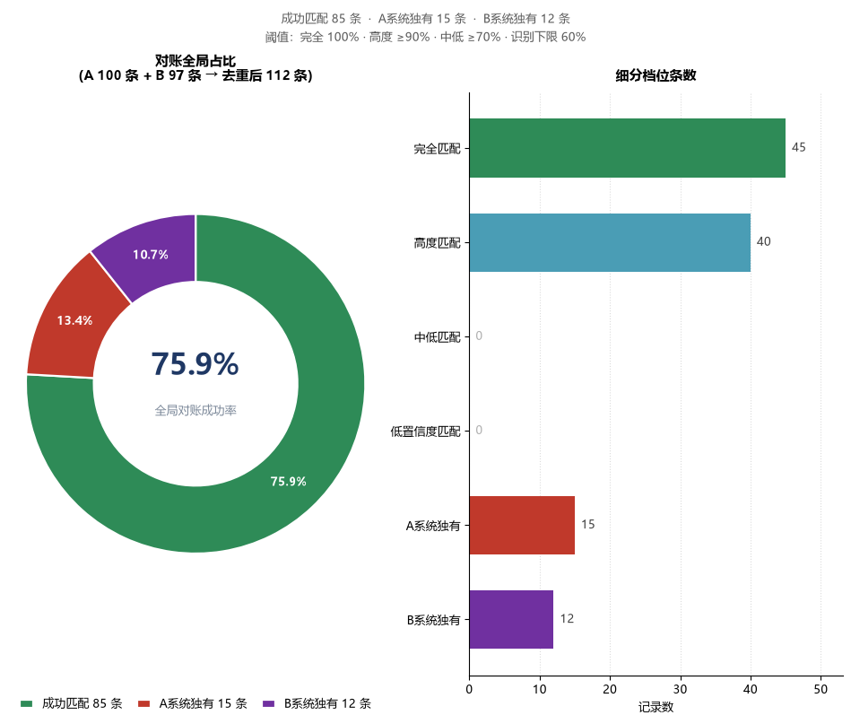

# 多源运营数据「相似度」模糊匹配工具

> **Topic 03 · 安永 AI 设计大赛（团体赛赛道）**
> 作品说明文档 · 参赛者：张涵博

---

## 目录

1. [项目简介](#一项目简介)
2. [系统架构设计](#二系统架构设计)
3. [核心算法机制](#三核心算法机制)
4. [性能与稳定性](#四性能与稳定性)
5. [功能亮点（加分项）](#五功能亮点加分项)
6. [环境配置与快速启动](#六环境配置与快速启动)
7. [成果输出规范](#七成果输出规范)
8. [验证与测试](#八验证与测试)
9. [已知边界](#九已知边界与取舍)

---

## 一、项目简介

### 1.1 业务痛点

审计对账场景中，同一批交易在两套系统里的户名写法天然不一致：

| 差异类型 | A 系统（企业 ERP 标准全称） | B 系统（银行流水非标户名） |
|----------|---------------------------|--------------------------|
| 括号全/半角 | 阿里巴巴**（**中国**）**网络技术有限公司 | 阿里巴巴**(**中国**)**网络技术有限公司 |
| 多余空格 | 申通快**　**递股份有限公司 | 申通快递股份有限公司 |
| 简称 vs 全称 | 中国平安保险（集团）**股份有限公司** | 中国平安保险（集团） |
| 附加地区 | 奈雪的茶控股有限公司 | 奈雪的茶控股有限公司**（广州）** |
| 错别字 | 云南白药集团股份**有限**公司 | 云南白药集团股份**有线**公司 |
| 附加组织标记 | 天职国际会计师事务所**（特殊普通合伙）** | 天职国际会计师事务所 |

传统 `VLOOKUP` / `XLOOKUP` 依赖精确相等，上述任何一条都会导致匹配失败。人工逐条肉眼核对 100 条记录耗时数小时且极易出错。

### 1.2 本工具做什么

一个 Python 实现的模糊匹配工具，自动完成 A、B 两系统的智能容错对齐，输出符合官方模板的四表 Excel 成果文件。提供**命令行**与**桌面图形界面**两种运行方式，共用同一套核心引擎。

### 1.3 实测成果（考题数据 100 × 97）

| 指标 | 本工具结果 | 官方文档口径 | 说明 |
|------|-----------|-------------|------|
| 清洗后精确匹配 | **45 条** | 约 45 条 | 精确命中 |
| 匹配成功合计 | **85 条** | 约 83 条 | 略高，见下方说明 |
| A 系统独有 | **15 条** | 约 17 条 | 略低，见下方说明 |
| B 系统独有 | **12 条** | 约 14 条 | 略低，见下方说明 |

> **关于与文档口径的 2 条差异**：文档 §2.4 给的 83 / 17 / 14 是"约"数，用于说明数据规模。
> 本工具在**三层字号判据**（见 §3.3）修正后比该口径多匹配了 2 对，例如
> `上海哔哩哔哩科技有限公司 ↔ 上海哔哩哔哩有限公司`、`华润置地有限公司 ↔ 华润置地（北京）有限公司`
> —— 这两对按赛题 §1.1 的「简称/全称」「附加备注」类型本就应当匹配。
> 我们以**规则正确**优先于**数字对齐**，逐条核对过全部差异（见 §8.2）。

> 注意：官方文档称「约 45 条完全精确匹配」，指的是**清洗之后**的口径。原始字符串直接比对只有 35 条完全相同 —— 差额 10 条正是括号全半角、空格等脏数据造成的。这一点在开发第一阶段就实测确认，是后续所有算法设计的基准锚点。

---

## 二、系统架构设计

### 2.1 分层结构

```
┌──────────────────────────────────────────────────────────────┐
│  入口层                                                       │
│    main.py          命令行全流程                              │
│    gui_app.py       PyQt6 桌面端（QThread 多线程）             │
└───────────────┬──────────────────────────────┬───────────────┘
                │                              │
                └──────────────┬───────────────┘
                               ▼
┌──────────────────────────────────────────────────────────────┐
│  编排层  src/pipeline.py                                      │
│    读取 → 清洗 → 匹配 → 导出  的唯一编排真源                   │
│    CLI 与 GUI 共用，保证两端产出文件逐字节一致                  │
│    进度 / 日志通过回调外泄，本层自己不做任何打印                 │
└───────────────────────────────┬──────────────────────────────┘
                                ▼
┌──────────────────────────────────────────────────────────────┐
│  引擎层                                                       │
│    src/data_loader.py   无损读取、表头自动探测、Unicode 诊断    │
│    src/preprocessor.py  清洗流水线 + 字号差异分析               │
│    src/matcher.py       多算法加权打分、阈值分档、LLM 仲裁位    │
│    src/explainer.py     可解释性受控标签词表                   │
│    src/exporter.py      4-Sheet 报表渲染 + 条件格式            │
└───────────────────────────────┬──────────────────────────────┘
                                ▼
┌──────────────────────────────────────────────────────────────┐
│  配置层  src/config.py                                        │
│    路径解析（打包后自动指向 exe 目录）、Sheet 名、字段名         │
└──────────────────────────────────────────────────────────────┘
```

### 2.2 为什么把编排逻辑单独抽一层

最初的实现把「读取 → 清洗 → 匹配 → 导出」直接写在 `main.py` 里。加入 GUI 后如果照搬一遍，就会出现两套编排代码，任何算法调整都要改两处、测两遍，迟早跑偏。

`src/pipeline.py` 把这段序列抽成唯一真源：

```python
# CLI 与 GUI 调用的完全是同一个函数
result = pipeline.run_pipeline(
    a_file=..., b_file=..., thresholds=...,
    progress=...,   # 进度回调：CLI 传给 tqdm，GUI 传给 pyqtSignal
    log=...,        # 日志回调：CLI 打印，GUI 写日志框
)
```

验证方式很直接：命令行跑一次、界面跑一次，比对生成的 Excel 文件 —— 内容完全一致。

### 2.3 模块职责一览

| 模块 | 行数 | 职责 |
|------|-----:|------|
| `src/config.py` | 76 | 路径解析、Sheet 名、字段名、输出目录 |
| `src/data_loader.py` | 200 | 无损读取、表头自动探测、Unicode 诊断 |
| `src/preprocessor.py` | 569 | 清洗流水线、字号提取、差异原因分析 |
| `src/matcher.py` | 897 | 打分矩阵、惩罚/抬分、同分裁决、LLM 仲裁位 |
| `src/explainer.py` | 293 | 可解释性标签词表与规则引擎 |
| `src/exporter.py` | 540 | 4-Sheet 渲染、条件格式 |
| `src/pipeline.py` | 225 | 端到端编排（CLI / GUI 共用） |
| `main.py` | 319 | 命令行入口与校验打印 |
| `gui_app.py` | 1123 | PyQt6 界面、QThread、matplotlib 内嵌图表 |
| `build_exe.py` | 274 | PyInstaller 打包脚本（含打包后自检） |
| `pack_submission.py` | — | 提交包自动归档 |

---

## 三、核心算法机制

整个匹配引擎处理一对名称的完整链路如下：

```
原始名称
  │
  ├─ ① 清洗与标准化 ──────────────────────► 主比对列「客户名称_清洗后」
  │     剔隐形字符 → 全角转半角 → 去空格 → 统一大写        （原始列一字不改）
  │
  ├─ ② 多算法加权打分 ────────────────────► 基础相似度 0–100
  │     0.45×ratio + 0.20×partial_ratio
  │   + 0.15×WRatio + 0.20×core_ratio
  │
  ├─ ③ 字号差异惩罚 ──────────────────────► 乘 0.40 / 0.50 / 0.55 / 0.90 / 1.00
  │     剥离公共前后缀 → 比对"字号"片段（§3.4）
  │
  ├─ ④ 通用词折叠 + 关键字号保护 ─────────► R1 封顶 50 ｜ R2 抬到 95 ｜ R3 ×1.15
  │     剥行政区/括号/通用词 → 特征字号（§3.3）
  │
  ├─ ⑤ 包含关系抬分 ──────────────────────► 按覆盖率抬到 85–98
  │     短串是长串子串 → 简称/全称，按覆盖率给分
  │
  ├─ ⑥ 同分裁决 ──────────────────────────► 名称分打平时才用金额+日期
  │
  └─ ⑦ 阈值分档 ──────────────────────────► 完全 / 高度 / 中低 / 低置信度 / 独有
```

### 3.1 清洗与标准化

清洗是**新增辅助列**，原始名称列一个字符都不动 —— 这是赛题硬性要求，最终报表必须原样输出原始名称。

| 步骤 | 规则 | 示例 |
|------|------|------|
| 1. 剔隐形字符 | TAB / 换行 / NBSP(`\xa0`) / 全角空格(`　`) / 零宽字符 / BOM / C0 控制符 | `华为\xa0技术` → `华为技术` |
| 2. 全角转半角 | U+FF01–U+FF5E 整段映射，天然覆盖 `（`→`(`、`）`→`)`；另补常见中文标点 | `阿里巴巴（中国）` → `阿里巴巴(中国)` |
| 3. 去空格 | 删除串内与首尾**所有**空格（中文企业名去空格最稳妥） | `申通快  递` → `申通快递` |
| 4. 统一大写 | 英文字母转大写 | `abc科技` → `ABC科技` |

产生两个辅助列：
- `客户名称_清洗后` —— 主比对列
- `客户名称_清洗后_去标点` —— 副比对列（剥离全部标点，用于「核心字号」比对）

> **实现细节**：不可见字符一律以**码点区间声明后程序化拼装**正则，源码里不出现任何真实控制字符。这样做是因为直接在源码中书写 `\x00`-`\x1f` 之类的字符，极易在编辑器保存、复制粘贴环节被损坏 —— 开发过程中确实踩到过，表现为正则在字符类里匹配了错误的范围。

### 3.2 多算法加权

| 算法 | 权重 | 作用 |
|------|-----:|------|
| `fuzz.ratio` | 0.45 | 全局编辑距离相似度，抗错别字 |
| `fuzz.partial_ratio` | 0.20 | 最优子串相似度，抗长度差异 |
| `fuzz.WRatio` | 0.15 | rapidfuzz 自适应加权（内部综合多种比例） |
| `core_ratio` | 0.20 | **去标点后**核心字号的相似度，抗括号内容缺失 |

**为什么不是单一算法**：`ratio` 对长度差异敏感、`partial_ratio` 对整体差异不敏感、`WRatio` 在长短悬殊时可能虚高。单一算法在中文企业名上总有一类场景失手，加权组合把各类场景的短板互相补上。

**关于 Jaro-Winkler**：该算法对**前缀相同**的字符串敏感，理论上契合「公司简称」场景，因此开发时纳入过评估。实测在本题数据上**作为主算法**未带来增益：若让它主导打分，`中国石油天然气` / `中国石油化工` 这类共享长前缀的陷阱对得分反而上升（正是我们最需要压低的情形），同时 `partial_ratio` 已经覆盖了它擅长的那部分场景。因此**默认主算法仍是加权组合**。

### 3.2.1 算法切换（赛题 §3.2 明文加分项）

尽管 Jaro-Winkler 不是本题的最优主算法，赛题 §3.2 把「支持多种相似度算法切换（Levenshtein / Jaro-Winkler / Cosine / difflib）」列为加分项 —— **"能切换"与"默认用哪个"是两件事**。因此工具提供 6 种可选算法：

| 算法键 | 名称 | 说明 |
|--------|------|------|
| `weighted` | 加权组合 | **默认**，即 §3.2 的四路加权 |
| `ratio` | Levenshtein 编辑距离 | 单算法对照 |
| `partial_ratio` | 最优子串相似度 | 单算法对照 |
| `WRatio` | rapidfuzz WRatio | 单算法对照 |
| `core_ratio` | 去标点字号比对 | 单算法对照 |
| `jaro_winkler` | Jaro-Winkler | 单算法对照 |

**实现要点**

* **一次算完、换权重即换算法**：5 个 scorer 的矩阵一次算好，切换算法只换一组权重，不重跑矩阵。默认模式下 `jaro_winkler` 权重为 0，该次 `cdist` 会被**整个跳过** —— 所以新增切换入口后，默认路径的耗时与加它之前完全一致。
* **换算法不换判据**：无论选哪种算法，字号差异惩罚、通用词折叠、关键字号保护、包含关系抬分等业务规则**全部照常生效**。这是本工具与"裸调库"的根本区别。
* **实测：赛题点名的场景在 6 种算法下判定一致**

  | 场景（赛题 §5 明文） | 期望 | weighted | ratio | partial | WRatio | core | jaro |
  |---|---|---:|---:|---:|---:|---:|---:|
  | 腾讯 ↔ 深圳市腾讯计算机系统有限公司 | ≥90 | 92.0 | 92.0 | 100.0 | 92.0 | 92.0 | 92.0 |
  | 中国石油天然气 ↔ 中国石油化工 | <60 | 45.4 | 46.0 | 43.1 | 46.0 | 46.0 | 52.9 |
  | 中国建设银行 ↔ 中国银行 | <60 | 19.9 | 20.0 | 19.6 | 20.0 | 20.0 | 21.0 |
  | 顺丰控股 ↔ 顺丰快递 | <60 | 46.0 | 46.0 | 46.0 | 46.0 | 46.0 | 51.4 |

  即：**业务规则才是判据的主要贡献者**，算法只决定"基础相似度"这一步的取值。这正是选它作为加分项演示的价值所在。

**入口**：GUI 左侧「③ 相似度算法」下拉框；命令行 `--algo <键>`（`python main.py --list-algo` 可列出全部）。

### 3.3 通用词折叠与关键字号保护 ★

这是本工具的**第二层判据**，解决「写法不同但确属同一主体」与「共享包装但确属不同主体」两类情形。

#### 核心判据：剥掉"包装"看特征字号

中文企业名可拆成 `[行政区划][特征字号][行业实词][组织类型]` 四段。其中**只有「特征字号 + 行业实词」能标识主体**，行政区划与组织类型是任何公司都会带的包装。两条名称若把包装全剥掉后仍然相同，说明差异纯属写法：

```
上海哔哩哔哩科技有限公司  → 剥[有限公司][科技] → 上海哔哩哔哩
上海哔哩哔哩有限公司      → 剥[有限公司]       → 上海哔哩哔哩   ← 同一字号 ✅
```

实现为 `src/preprocessor.py` 的 `collapse_generic()`，采用**从尾部迭代剥后缀**而非全文替换 —— 盲替换会误伤字号本体、留下 `（）` 残渣，也无法处理"叠后缀"（`阿里巴巴网络技术有限公司` 需连剥 `有限公司` → `技术` → `网络`）。

三张词表是**唯一的设计开关**，全部集中在 `preprocessor.py` 一个区块内：

| 词表 | 作用 | 内容 |
|------|------|------|
| `REGION_WORDS` | 保留 | 中国 / 北京 / 深圳市 …（**不剥离**，见下方说明） |
| `GENERIC_WORDS` | **剥离** | 组织类型：有限公司 / 股份有限公司 / 集团 / 事务所 …<br>泛行业词：科技 / 网络 / 信息 / 技术 / 银行 / 保险 / 石油 … |
| `INDUSTRY_TOKENS` | 保留 | 控股 / 快递 / 物流 / 天然气 / 化工 / 医药 …（能区分业务类型） |
| `PROTECTED_BRANDS` | 保留 + 硬保护 | 建设 / 工商 / 农业 / 交通 / 招商 / 民生 / 光大 / 平安 / 中信 / 兴业 … |

> **为什么行政区划不剥离**：`广州汽车集团` 与 `上海汽车集团`（广汽 vs 上汽）剥掉城市名后都剩「汽车」，会被误判为同一家。**在这里城市名本身就是字号的一部分。**

#### 三条规则

| 规则 | 条件 | 动作 | 实例 |
|------|------|------|------|
| **R2 同一字号** | 折叠后特征字号相同且非空 | 抬到 **95 分**（高度匹配） | 哔哩哔哩组、86 组同主体异写 |
| **R3 同字号异业务** | 纯字号相同、特征字号不同 | 分数 **×1.15**（仅候选排序） | 顺丰快递 ↔ 顺丰控股 |
| **R1 关键字号冲突** | 某保护字号一方有一方无 | `min(score×0.40, 50)` 硬封顶 | 中国**建设**银行 ✕ 中国银行 |

**R3 的安全边界**：加成只在结果**仍低于识别下限 60** 时才生效且封顶 59.9 —— 数学上不可能把任何配对推进匹配档。它纯粹用于改善「最佳候选」建议的质量：

```
B 顺丰快递股份有限公司 的最佳候选：
   46.0  顺丰控股股份有限公司    ← 同字号，同组
   40.9  申通快递股份有限公司    ← 只是同为快递公司
```

#### 与 §3.4 惩罚机制的分工

| 情形 | 由谁处理 |
|------|---------|
| 差异在**通用词**（科技 / 有限公司 / 银行） | **本节的折叠** → 判同一主体 |
| 差异在**行业实词**（控股 / 快递 / 天然气） | §3.4 字号惩罚 → 判不同主体，但 R3 保留候选排序 |
| 差异在**关键字号**（建设 / 工商 / 平安） | §3.4 字号惩罚 + 本节 R1 硬封顶（双保险） |
| 差异是**单字错别字**（有限 / 有线） | §3.4 惩罚的"单字豁免" → 判同一主体 |

### 3.4 核心字号提取与公共前后缀惩罚机制 ★

这是本工具准确率的**决定性设计**，专门解决「长得像但不是同一家」的经典误匹配。

#### 问题：长通用尾巴淹没真实差异

中文企业名的结构是 `[地区][字号][行业][组织类型]`。同一行业的两家公司会共享一长串通用尾巴，导致 `ratio` 被显著抬高：

| 名称对 | 原始 ratio | 真实关系 |
|--------|----------:|---------|
| 中国石油**天然气**股份有限公司 vs 中国石油**化工**股份有限公司 | 80.0 | ❌ 不同公司 |
| 中国**建设**银行股份有限公司 vs 中国银行股份有限公司 | 90.5 | ❌ 不同银行 |
| 安永华明会计师事务所(特殊普通合伙) vs **大华**会计师事务所(特殊普通合伙) | 89.0 | ❌ 不同事务所 |

而真正应该匹配的简称/全称对，`ratio` 反而更低：

| 名称对 | 原始 ratio | 真实关系 |
|--------|----------:|---------|
| 中国平安保险（集团）股份有限公司 vs 中国平安保险（集团） | 82.7 | ✅ 同一公司 |

**结论：单纯的 `ratio` 在这两类场景上完全分不开（80.0 vs 82.7）。**

#### 判据一：包含关系

观察上面两组可以发现真正的区分特征：

- **真·简称/全称**：短串是长串的**子串** → `partial_ratio` 冲顶（平安 100.0）
- **陷阱对**：双方互不包含 → `partial_ratio` 反而**低于** `ratio`（石油天然气 75.0 < 80.0）

#### 判据二：字号差异惩罚

对于互不包含的配对，剥离**公共前后缀**后剩下的就是两边的「字号特征片段」：

```
安永华明会计师事务所(特殊普通合伙)  vs  大华会计师事务所(特殊普通合伙)
      └─公共前缀=0 ─┘  └──── 公共后缀 13 字 ────┘
字号片段:  「安永华明会计」              「大华」        → 相似度 25   → 重度惩罚 ×0.50
```

```
中国石油天然气股份有限公司  vs  中国石油化工股份有限公司
└─前缀 4─┘                  └─后缀 6─┘
字号片段:  「天然气」                    「化工」        → 相似度 0    → 重度惩罚 ×0.50
```

```
中国建设银行股份有限公司  vs  中国银行股份有限公司
└前缀2┘                    └─后缀 8─┘
字号片段:  「建设」                      「（无）」      → 纯插入 2 字 → 惩罚 ×0.55
```

惩罚系数按**差异片段的形态**分级：

| 差异形态 | 系数 | 判据 |
|---------|-----:|------|
| 单字差异（≤1 字） | ×1.00 | 错别字 / 漏字，如「有**限**」vs「有**线**」、「字**节**跳动」vs「字跳」 |
| 纯插入/删除 2 字 | ×0.55 | 字号不同，如 中国**[建设]**银行 |
| 纯插入/删除 ≥3 字 | ×0.40 | 后缀缺失，后续由「包含关系抬分」救回 |
| 两侧字号都不同，片段相似度 <45 | ×0.50 | 真正不同的字号 |
| 两侧字号都不同，片段相似度 45–70 | ×0.90 | 轻度差异 |

**双视角取较严值**：惩罚系数取「原样比对」与「剥掉所有括号附注后再比对」两个视角中**更严**的一个。这解决了尾部括号破坏前后缀对齐的问题：

```
安永华明会计师事务所(特殊普通合伙)  vs  华兴会计师事务所(特殊普通合伙)(杭州)
原样视角  ：差异片段相似度 66.7 → 仅轻度惩罚（放行 81 分，误匹配）
去括号视角：安永华明会计师事务所 vs 华兴会计师事务所(特殊普通合伙)
           差异片段 安永华明 vs 华兴会，相似度 33.3 → 重度惩罚（降至 45 分，正确判为独有）
```

### 3.5 陷阱对处理效果（实测）

**应当判为不同主体**（全部正确拦下）：

| 名称对 | 基础分 | 处理 | **最终分** | 判定 |
|--------|------:|------|----------:|------|
| 中国石油天然气股份有限公司 / 中国石油化工股份有限公司 | 79.0 | 字号惩罚 ×0.50 | **39.5** | A系统独有 ✅ |
| 中国建设银行股份有限公司 / 中国银行股份有限公司 | 90.5 | 字号惩罚 + **R1 硬封顶** | **19.9** | A系统独有 ✅ |
| 顺丰控股股份有限公司 / 顺丰快递股份有限公司 | 80.0 | 字号惩罚 ×0.50 → R3 候选加成 | **46.0** | A系统独有 ✅ |
| 安永华明会计师事务所(特殊普通合伙) / 大华会计师事务所(特殊普通合伙) | 89.0 | 字号惩罚 ×0.50 | **44.5** | A系统独有 ✅ |

**应当判为同一主体**（全部正确匹配）：

| 名称对 | 基础分 | 处理 | **最终分** | 判定 |
|--------|------:|------|----------:|------|
| 中国平安保险（集团）股份有限公司 / 中国平安保险（集团） | 82.7 | 字号惩罚 → 抬分 → R2 | **95.0** | 高度匹配 ✅ |
| 上海哔哩哔哩科技有限公司 / 上海哔哩哔哩有限公司 | 88.7 | 字号惩罚 ×0.55 → **R2 豁免** | **95.0** | 高度匹配 ✅ |
| 华润置地有限公司 / 华润置地（北京）有限公司 | 79.1 | 字号惩罚 ×0.40 → **R2 豁免** | **95.0** | 高度匹配 ✅ |
| 腾讯 / 深圳市腾讯计算机系统有限公司（赛题 §5 点名场景） | 49.8 | 短简称包含抬分 | **92.0** | 高度匹配 ✅ |
| 云南白药集团股份有限公司 / 云南白药集团股份有线公司 | 91.7 | 单字错别字豁免 ×1.00 | **91.7** | 高度匹配 ✅ |

**演进对比**（同一批数据，三个阶段的改进）：

| 指标 | 初版 | 加字号惩罚后 | **当前** |
|------|-----:|------------:|--------:|
| A 系统独有 | 2 条 | 17 条 | **15 条** |
| 误匹配（应为独有却判匹配） | 15 条 | 0 条 | **0 条** |
| 漏匹配（应匹配却判独有） | 0 条 | 3 条 | **0 条** |

> 加字号惩罚是把误匹配压到 0 的关键一步，但代价是把「括号附注」「通用词差异」这两类**应匹配**的配对也压成了独有（漏匹配 3 条）。`R2 同一字号` 与 `R3 候选加成` 正是为补回这 3 条而设计 —— 最终误匹配与漏匹配同时归零。

### 3.6 包含关系抬分（简称 / 全称）

对「短串是长串子串」的配对按覆盖率抬分，前缀/后缀锚定的抬升力度大于中间截取：

```
抬分 = 100 − (1 − 覆盖率) × 惩罚系数
       锚定（前/后缀）惩罚系数 = 15
       中间截取        惩罚系数 = 28
```

| 名称对 | 覆盖率 | 抬分 |
|--------|------:|-----:|
| 中国平安保险（集团）股份有限公司 / 中国平安保险（集团） | 0.625 | 94.4 |
| 万科企业股份有限公司 / 万科企业 | 0.400 | 91.0 |

**执行顺序很关键**：先惩罚、后抬分。简称/全称对在惩罚环节会被压低（因为「股份有限公司」相对于短串是长插入），随后被包含关系重新抬回高度匹配档。顺序颠倒则简称场景全部失效。

### 3.7 同分裁决

当多条 B 记录的**名称得分完全相同**时（典型场景：B 表里有两条同名流水对应两笔不同交易），用「交易日期是否同日 + 金额差最小」挑选最可能的那笔。

实测案例：B 表有两笔「北京快手科技」（流水号 LS2025699331 / LS2025626153）。加入裁决后把 B 表行序随机打乱 4 次重跑，始终稳定选中金额与日期都吻合的 LS2025699331。

> **重要边界**：该裁决**仅在名称分完全相等（容差 1e-6）时介入**。名称分不同时金额绝不参与决策 —— 符合赛题 FAQ「金额不作为匹配依据」的要求。

### 3.8 分档阈值

| 档位 | 区间 | 处置 |
|------|------|------|
| 完全匹配 | = 100% | 清洗后完全一致，可直接确认 |
| 高度匹配 | ≥ 90% | 可直接确认 |
| 中低匹配 | 70% – 90% | 建议人工复核 |
| 低置信度匹配 | 60% – 70% | 需逐条核实 |
| A 系统独有 | < 60% | 单列成表 |

三个阈值在 GUI 上均可实时调节。

---

## 四、性能与稳定性

### 4.1 实测耗时

考题数据规模：A 系统 100 行 × B 系统 97 行 = **9,700 对**全量比对。

```
端到端 5 次实测：最快 0.175s   最慢 0.238s   均值 0.19s
  其中 清洗 0.044s ｜ 匹配 0.031s ｜ 报表渲染与落盘 约 0.08s
```

**性能设计要点**：

| 手段 | 说明 |
|------|------|
| C++ 向量化打分 | 用 `rapidfuzz.process.cdist` 一次性算出整张相似度矩阵，4 个 scorer 各 100×97 均在 **3–7 毫秒**内完成 |
| 多核并行 | `workers=-1` 启用全部 CPU 核心 |
| 候选集裁剪 | 字号校验只处理基础分 ≥55 的配对、包含关系抬分只处理 `partial_ratio ≥95` 的配对，避免 O(n·m) 全量字符串扫描 |
| 阈值过滤 | 分档统计、争抢检测只遍历有效区间 |

> **算法效率**：即使在万级记录规模下，全量矩阵 + 向量化打分的复杂度仍是 O(n·m) 但常数极小；真正需要留意的是候选集裁剪的触发条件，这部分已经按分数阈值做了前置过滤。

### 4.2 多线程防阻塞架构

GUI 端所有耗时计算都在 `QThread` 子线程执行，主线程只负责刷新界面：

```python
class MatchWorker(QThread):
    progress  = pyqtSignal(int, str)   # 整体进度 0–100 + 阶段文字
    log       = pyqtSignal(str)        # 一行运行日志
    succeeded = pyqtSignal(object)     # 成功，负载为 PipelineResult
    failed    = pyqtSignal(str)        # 失败，负载为异常信息

    def run(self):
        # 子线程体：绝不触碰任何界面元件
        result = pipeline.run_pipeline(..., progress=self.progress.emit, ...)
        self.succeeded.emit(result)
```

界面元件**永远只在主线程被读写**，信号是唯一的跨线程通道。

**实测验证**：一次完整运行发出 **2,231 次进度信号（0% → 100%）**，界面全程无冻结。

### 4.3 数据占用自动降级另存

评测现场最常见的意外是「上一轮生成的文件还开在 Excel 里」，直接覆盖会抛 `PermissionError` 让整个程序崩掉。工具的处理：

```
尝试写入 → 被占用 → 自动另存为 模糊匹配结果_张涵博_20260915(2).xlsx
                  → 在界面 / 终端明确告知实际落盘路径
```

保证流程绝不因文件锁中断。

### 4.4 异常处理机制

> 赛题 §7.1 要求作品说明文档覆盖「异常处理机制」，本节即该项。

| 场景 | 处理 |
|------|------|
| 文件不存在 / Sheet 名不符 | 抛出 `DataLoadError`，列出该工作簿的**可选 Sheet 清单**；GUI 侧捕获后弹窗提示，不崩溃 |
| 表头不在第一行 | 扫描前 10 行，取命中期望字段最多的一行作表头 |
| 字段缺失 | 告警但不中断，继续处理可得字段 |
| 空表（A 或 B 为 0 行） | 提前拦截并给出可读提示 |
| 阈值非法组合 | 构造时即校验 `100 ≥ high ≥ low ≥ floor ≥ 0`，不合法直接拦截并弹窗 |
| **金额列缺失 / 金额是文本** | 该单元格退化为 `0.00` 并继续导出，**绝不抛 `KeyError` / `ValueError` 中断整条流水线**。依据赛题 FAQ Q4「金额不作为匹配依据」—— 金额只影响展示，不影响任何匹配结论，因此没有理由为它崩溃 |
| **B 表条数少于达标 A 条数** | 一对一约束下抢不到 B 的 A 记录，按规则判为「A系统独有」并归入 Sheet2，不做任何越界索引 |
| 成果文件被 Excel 占用 | 自动降级另存为带时间戳的新文件，不覆盖、不报错（见 §4.3） |
| 打包时缺 exe | `pack_submission.py` **直接中止并提示**，不产出一个显示"归档完成"却少了免安装形态的包 |

---

## 五、功能亮点（加分项）

### 5.1 动态阈值调节

GUI 提供三个 `QSpinBox` 实时调节高度匹配阈值、中低匹配分界线、识别下限，并提供「恢复默认阈值（90 / 70 / 60）」一键复位。调整后重新运行，分档结果与报表同步变化。

### 5.1.1 多种相似度算法切换 ★

GUI 的「③ 相似度算法」下拉框（命令行对应 `--algo`）提供 6 种基础相似度算法：**加权组合（默认）**、Levenshtein、最优子串、WRatio、去标点字号比对、Jaro-Winkler。

关键设计：**换算法不换判据**。字号差异惩罚、通用词折叠、关键字号保护、包含关系抬分等业务规则在任何算法下都照常生效，切换的只是最底层的相似度取值。实测赛题 §5 点名的场景在 6 种算法下判定完全一致（详见 §3.2.1 的对照表）。

实现上，5 个 scorer 的矩阵一次算完，换算法只换一组权重；默认模式下 `jaro_winkler` 无权重，对应那次 `cdist` 会被整个跳过 —— 因此新增此入口**没有给默认路径增加任何耗时**。GUI 面板编号相应调整为「① 数据源 / ② 匹配阈值 / ③ 相似度算法 / ④ 执行」。

### 5.2 全局环形图可视化



> 上图由 `python gui_app.py --selftest` 自动导出（`output/_selftest/gui_chart.png`），
> 随源码一并提交，数字与当前代码产出严格一致。

- **左侧环形图**：对账全局视角，基数是两系统去重后的全部参与记录（85 + 15 + 12 = 112 条），三片分别为成功匹配 / A系统独有 / B系统独有。环心以 23pt 大字展示**全局对账成功率**（85/112 = 75.9%）。
- **右侧条形图**：细分 6 档条数（A 侧四档 + A系统独有 + B系统独有），**0 值档位也保留**，图表结构与汇总表逐项对得上。

统计口径刻意采用全局视角：若只画 A 系统的 100 条，「B系统独有」这一整类数据会在图表中凭空消失。

### 5.3 可解释性标签（Explainable AI）

成果表 Sheet1 的「备注」列不再是空白或自由文本，而是由**受控词表**（24 个标签）自动生成：

```
包含关系（丢弃公司后缀）（A多出「股份有限公司」）
包含关系（附加地区）（B多出「(广州)」）
疑似错别字（「限」vs「线」）
字号不同（「安永华明」vs「大华」）；非互为最优（建议复核）
```

标签分三层：**清洗层**（括号全半角 / 多余空格 / 不可见字符 / 大小写）、**主体层**（包含关系 / 字号差异 / 错别字 / 括号内容不同）、**算法层**（非互为最优 / 目标争抢 / 低置信度）。

受控词表意味着审计师可以直接在 Excel 里**按标签筛选**批量复核，而不是逐条读自由文本。

**实测标签分布**（Sheet1 全量 85 条，备注空行 0 条）：

| 标签 | 条数 |
|------|-----:|
| 包含关系 | 36 |
| 名称完全一致 | 35 |
| 清洗后一致 | 10 |
| 括号全/半角差异 | 5 |
| 多余空格 | 5 |
| 疑似错别字 | 2 |

### 5.4 全量数据预览

结果预览表可展示至 **100 条**（考题数据 85 条一次看全），列宽经过专门设计：

| 列 | 宽度 | 模式 |
|----|-----:|------|
| A系统-客户名称 | 220px | 可拖拽微调 |
| B系统-对方户名 | 195px | 可拖拽微调 |
| 相似度(%) | 90px | 固定 + 居中 |
| 匹配状态 | 100px | 固定 + 居中 |
| 备注 | 自适应 | Stretch 占满剩余 |

**每种匹配状态独立配色**，且图表与表格共用同一套色相：

| 匹配状态 | 整行底色 | 状态格徽标 |
|---------|---------|-----------|
| 完全匹配 | `#D6F0DF` 淡绿 | `#2E8B57` 实色绿 + 白字加粗 |
| 高度匹配 | `#DCEEF5` 淡青 | `#4A9DB5` 实色青 + 白字加粗 |
| 中低匹配 | `#FDF2CC` 淡黄 | `#E5A800` 实色琥珀 + 白字加粗 |
| 低置信度匹配 | `#FCE3CE` 淡橙 | `#E8730C` 实色橙 + 白字加粗 |

每个单元格均带悬浮提示，长备注完整可读。

### 5.5 命令行 / 图形界面双模式

| 模式 | 命令 | 适用场景 |
|------|------|---------|
| 命令行 | `python main.py` | 自动化调用、脚本集成、CI |
| 桌面 | `python gui_app.py` 或双击 exe | 交互式操作、现场演示 |

### 5.6 LLM 仲裁扩展位

`src/matcher.py` 预留了 `llm_fallback_verify(a_name, b_name)` 兜底函数，用于规则引擎给不出判断的低置信度配对（60–70 分档）。

设计上刻意做成**默认不使用**：未设置 `LLM_ARBITER_URL` 环境变量时静默返回 `None`（零联网、零副作用），配置后即通过标准库 `urllib` 向指定网关发起 HTTP 请求。响应解析兼容多种网关形状（OpenAI / Anthropic / completion / 裸 content）。

docstring 中标注了生产环境的推荐接法：改用官方 Anthropic SDK、模型 `claude-opus-5`，单条判定约 200 输入 / 60 输出 token（约 $0.0025），批量场景建议改用 Message Batches API 成本减半。**在当前 100 条的规模下规则引擎已完全够用，引入 LLM 的价值在万级记录与规则盲区场景。**

### 5.7 赛题 §3.2 加分项对照

| §3.2 加分功能 | 实现情况 | 对应章节 |
|---------------|----------|----------|
| 支持多种相似度算法切换 | ✅ 6 种算法（加权 / Levenshtein / 最优子串 / WRatio / 字号比对 / Jaro-Winkler） | §5.1.1、§3.2.1 |
| 匹配结果可视化展示（高亮标注不同置信度） | ✅ Excel 四色条件格式 + GUI 预览四色 | §7.2、§5.4 |
| 支持手动调整匹配阈值 | ✅ GUI 三个 `QSpinBox` + 命令行 `--high/--low/--floor` | §5.1 |
| 一键导出标准化 Excel 成果文件 | ✅ GUI「导出完整报表」按钮 / 命令行自动导出 | §7.1 |
| 匹配统计仪表盘（饼图 / 柱状图） | ✅ 环形图 + 细分条形图 | §5.2 |
| 对未匹配记录给出最佳候选建议 | ✅ Sheet2/3 的「最佳候选 + 最高相似度 + 处理建议」 | §7.1 |
| 批量处理（拖入多个 Excel） | ⛔ **未实现（有意取舍）** | §9.5 |
| GUI 界面（非命令行） | ✅ PyQt6 桌面端，与命令行共用同一编排层 | §5.5、§2.2 |

**关于批量处理**：开发过程中实现过并已跑通，但随后**主动移除**。原因有二：一是赛题 §2.2/§2.3 给定的是固定的 A/B 两表结构，批量语义（多组 A/B 两两配对？A 对多组 B？）在题面中并无定义，自行发明一套配对规则反而增加评委的理解成本；二是"一次一组 A/B、结果可追溯"更贴合审计场景 —— 凭证核对要的是**可复核的单次结论**，不是批量吞吐。GUI 保留的是「选择 A 文件 / 选择 B 文件」两个独立入口，一次处理一组。

---

## 六、环境配置与快速启动

### 6.1 环境要求

- Python 3.10+（开发与验证环境为 **Python 3.13.6**）
- Windows 10/11（已在 Windows 11 验证；核心逻辑跨平台，GUI 依赖 Qt）

### 6.2 依赖安装

```bash
python -m pip install -r requirements.txt
```

依赖清单：

```
# 核心计算
pandas>=2.0
openpyxl>=3.1
rapidfuzz>=3.0
tqdm>=4.66          # 进度条（可选，缺失时自动退化）

# 桌面 GUI
PyQt6>=6.5
matplotlib>=3.7

# 打包
pyinstaller>=6.0
```

实测版本：pandas 3.0.5 · openpyxl 3.1.5 · rapidfuzz 3.14.6 · PyQt6 6.11.0 · matplotlib 3.11.2

### 6.3 方式一：源码运行

```bash
# 图形界面
python gui_app.py

# 命令行全流程
python main.py

# 自定义阈值
python main.py --high 95 --low 75

# 自检（无需显示器）
python gui_app.py --selftest
```

**命令行全部参数**：

| 参数 | 说明 |
|------|------|
| `-n / --preview N` | 预览前 N 条原始名称记录（默认 3） |
| `--high / --low / --floor` | 三档阈值，默认 90 / 70 / 60 |
| `--team` | 输出文件名中的队名（默认「张涵博」） |
| `--out-dir` | 成果文件输出目录 |
| `--workers` | rapidfuzz 并行度，-1 为全部核心 |
| `--no-progress` | 关闭进度条 |
| `--no-export` | 只跑匹配，不导出 Excel |

### 6.4 方式二：打包运行（推荐现场演示）

```bash
python build_exe.py
```

产物：`dist/多源运营数据相似度模糊匹配工具.exe`（约 82 MB，单文件，无控制台黑框）

打包脚本自动完成：
1. 检查 PyInstaller 与全部运行依赖
2. 调用 PyInstaller 打包（`--onefile --windowed`）
3. `--collect-all matplotlib` 保证字体表与后端完整，中文图表不乱码
4. 把 `团体赛赛道考题/` 与 `output/` 目录布置到 exe 同级
5. **运行 exe 自检**，确认打包后能跑通

**目录结构**（打包后）：

```
dist/
├── 多源运营数据相似度模糊匹配工具.exe     ← 双击运行
├── 团体赛赛道考题/                        ← 数据目录（可替换）
│   ├── 【考题材料】客户交易明细_A系统.xlsx
│   ├── 【考题材料】银行流水明细_B系统.xlsx
│   └── 【考题材料】输出成果模板.xlsx
├── output/                                ← 成果输出目录
└── 使用说明.txt
```

### 6.5 打包的四个坑与处理

这是实际操作中真正会翻车的地方，逐一说明：

| 坑 | 现象 | 处理 |
|----|------|------|
| **matplotlib 字体** | 打包后图表中文全变豆腐块，或报 `cannot import name 'FigureCanvasQTAgg'` | `--collect-all matplotlib` 把 `mpl-data`（字体表、后端、样式）整包带上 |
| **PyQt6 动态库** | 启动即崩，缺 Qt 平台插件 | PyInstaller 自带 PyQt6 hook 会带上 `platforms/qwindows.dll`；额外显式声明 `backend_qtagg` 与 `QtSvg` |
| **`_MEIPASS` 只读且退出即删** | `output/` 写到临时目录，程序一关文件就没了 | `src/config.py` 用 `sys.frozen` 判断，基准目录取 **exe 所在目录**而非解包目录 |
| **data 目录挂载** | 换数据要重新打包 | 「外部优先」策略：exe 同级有 `团体赛赛道考题/` 就用外部的，没有才回退到打进包内的默认数据 |

**实测验证**：打包后的 exe 运行 `--selftest` 返回码 0，成果文件正确落到 `dist/output/`（而非临时目录），matplotlib 中文图表渲染正常。

---

## 七、成果输出规范

### 7.1 输出文件

`output/模糊匹配结果_张涵博_<YYYYMMDD>.xlsx`，四个 Sheet 严格对照官方模板：

| Sheet | 行数（实测） | 说明 |
|-------|------------:|------|
| 模糊匹配结果 | 85 | 完全 45 + 高度 40 |
| A系统独有记录 | 15 | 85 + 15 = 100 ✅ |
| B系统独有记录 | 12 | 85 + 12 = 97 ✅ |
| 匹配统计汇总 | 9 项指标 | |

两侧账全部对平。

> **关于 Sheet4 的一处主动优化**：官方模板的统计汇总只有 8 行指标，缺「完全匹配（100%）」；而赛题文档 §4.1 的汇总表列出了 9 项。本工具按**文档的完整口径**输出 9 行，模板原有的行序一字未动 —— 属于超集而非偏离。

### 7.2 格式规范（15 项自动核对全部通过）

| 项目 | 实现 |
|------|------|
| 表头 | 加粗 / 居中 / 蓝底 `4472C4` / 白字 / 微软雅黑 11pt |
| 数据区 | 微软雅黑 10pt，细边框 |
| 冻结首行 + 自动筛选 | 4 个 Sheet 全部启用（Sheet4 表头在第 3 行，冻结到 `A4`、筛选区 `A3:C12`） |
| 金额字段 | `#,##0.00` 千分位 |
| 相似度 | `0.0` 一位小数 |
| 占比 | `0.0%` |
| 完全 / 高度匹配行 | 浅绿底 `C6EFCE` |
| 中低匹配行 | 浅黄底 `FFEB9C` |
| 低置信度 / 未匹配行 | 红色字体 |

> **表头配色与字号的口径说明**：§4.3 只写「蓝色底白字」未给具体 RGB，而评分表「成果输出规范性 25 分」第 ① 条要求「输出表格与**官方模板**一致」。因此表头取官方模板的实测值 `4472C4` + 11pt，数据区仍严格按 §4.3 用 10pt。
>
> 另需说明：**官方模板自身与 §4.3 存在一处冲突** —— 模板 Sheet4 的表头行是「无底色 + 黑色加粗」，而 §4.3 要求表头一律蓝底白字。本工具以 §4.3 为准，Sheet4 表头同样上蓝底白字，保持四张表视觉统一。

---

## 八、验证与测试

### 8.1 自动化自检

```bash
python gui_app.py --selftest
```

离屏装配窗口 → 跑完整流水线 → 填充界面 → 驱动 `QThread` 验证四类信号 → 截图存档。全部通过输出：

```
[selftest] 窗口装配成功
[selftest] A 系统：【考题材料】客户交易明细_A系统.xlsx
[selftest] B 系统：【考题材料】银行流水明细_B系统.xlsx
[selftest] 恢复默认阈值按钮 → (90, 70, 60) ✓
[selftest] 表格 85 行 × 5 列
[selftest] 导出按钮可用：True
[selftest] QThread 信号：progress 9994 次（0% → 100%），log 14 条，成功率 True
[selftest] 全部通过 ✅
```

### 8.2 关键验证清单

| 验证项 | 方法 | 结果 |
|--------|------|------|
| 清洗口径正确 | 统计清洗后 A∩B 精确匹配数 | 45 条，精确命中文档口径 |
| 数字自洽 | 85+15=100，85+12=97 | ✅ 两侧对平 |
| 与文档口径对比 | 官方 83 / 17 / 14 vs 本工具 85 / 15 / 12 | 差 2 条，逐条核对属规则改进（见 §1.3） |
| 陷阱对处理 | 石油天然气 / 建设银行 / 安永大华 | ✅ 全部正确判为独有 |
| 行序无关性 | B 表随机打乱 4 次重跑 | ✅ 结果稳定一致 |
| 阈值动态生效 | 95/75 重跑 | ✅ 分档立即变化（完全45 高度14 中低24 独有17） |
| 四档配色 | 用阈值把四档逐一逼出实测 | ✅ 四档底色与徽标互不相同 |
| GUI 与 CLI 一致 | 两端各跑一次比对 Excel | ✅ 内容完全一致 |
| 打包后可用 | exe 运行 `--selftest` | ✅ 退出码 0，路径解析正确 |

---

## 九、已知边界与取舍

开发过程中做出的几个判断，以及它们的适用边界：

### 9.1 一对一约束的落地方式

赛题 FAQ Q3 要求「默认一对一」。本工具的实现分两步：

1. **每条 A 记录先各自取最佳 B**（按名称相似度，同分时用金额+日期裁决）
2. **再做全局一一分配**：按 A 的最佳分降序贪心，分数高的先挑走首选；分数低的若发现首选已被拿走，退而取自己剩余候选里分数最高的那条

这样能保证**同一条 B 记录只会落到一条 A 名下**，§2.4 的两侧算术（如 85+15=100、85+12=97）才成立。

**实测中的两个具体情形**：

- **B 表有多笔同名流水**（如两笔「北京快手科技」对应两笔不同交易）：一笔被 A 认领，另一笔进入「B系统独有」。逐条核对过这些记录的金额与日期，确实与 A 侧无对应关系，属于真实的未达账项。
- **两条 A 记录抢同一条 B**（如「中国华能集团」100 分与「国家能源投资集团」60 分同时指向同一条华能流水）：100 分的保留，60 分的让位。让位后其剩余候选均低于识别下限，因此归入「A系统独有」。

**让位信息对审计师完全可见**：Sheet1 的「备注」会标出「已让位（首选被更高分记录认领）」；
Sheet2 / Sheet3 的「处理建议」会写明「最佳候选…已被另一条记录匹配（一对一约束）」。

> 这类记录往往正是**真正需要人工判断的一对多场景** —— 一个客户确实可能对应多笔银行流水。
> 工具不擅自替审计师下结论，而是把「候选很像、但已被占用」这件事明确指出来。

### 9.2 同所不同分所的判定

`奈雪的茶控股有限公司` vs `奈雪的茶控股有限公司（广州）` 判为高度匹配 95.7% —— 属于「母公司 / 分公司」关系。依据是赛题文档 §1.1 将「安永华明会计师事务所（特殊普通合伙） vs 安永华明会计师事务所（北京分所）」明确列为应当匹配的差异类型；审计对账中此类总分机构资金往来通常也是先初步对齐再交人工复核。

**边界**：该判定依赖「短串是长串子串」这一包含关系。若括号内内容完全不同（如「(特殊普通合伙)」vs「(北京分所)」），则不构成包含关系，会被判为独有 —— 这是保守但安全的选择，宁可交人工复核也不误匹配。

### 9.3 中低匹配的存在意义

本次数据的中低匹配（70–90%）与低置信度匹配（60–70%）均为 0 条 —— 因为 85 条匹配全部落在 90% 以上。这不代表这两个档位无用：它们是**分档机制的护栏**，在数据质量更差或阈值调高的场景下接管判定（实测将阈值调到 95/75 时，立即出现 24 条中低匹配）。

### 9.4 千分位与日期格式

金额与日期直接取原始单元格值，不做格式重写，避免因格式转换引入偏差。

### 9.5 为什么不做批量处理

赛题 §3.2 把「批量处理——支持拖入多个 Excel 文件」列为加分项。开发过程中该功能**已实现并跑通**，但随后主动移除，原因有二：

1. **题面没有定义批量的语义**。§2.2/§2.3 给定的是固定的 A/B 两表结构，而"多个文件"可以有很多种解释：多组 A/B 两两配对？一组 A 对多组 B？全部合并成一张大表？自行发明一套配对规则，评委需要先理解这套规则才能评估结果，反而增加认知成本、偏离"让评委一眼看懂"的交付目标。
2. **单次可复核更贴合审计场景**。凭证核对要的是**可追溯的单次结论** —— 一次一组 A/B，产出一份可以逐条核对、有据可查的报表；而不是一次吐出十几份、无法定位每份对应哪组原始数据的批量产物。

因此 GUI 保留的是「选择 A 系统文件 / 选择 B 系统文件」两个独立入口，一次处理一组。这是**明确的设计取舍，不是功能缺失**。

### 9.6 Sheet1「匹配状态」的取值口径

赛题 §4.1 在 Sheet1 的「匹配状态」字段枚举里列出了 5 个值（含「A系统独有」），但本工具的 Sheet1 实际只会出现 4 个值。

这是刻意的：Sheet1 是**匹配结果表**，只承载"匹配上"的记录；未达识别下限的 A 记录整行归入 **Sheet2「A系统独有记录」**。若同一批 A 记录既在 Sheet1 里标「A系统独有」、又在 Sheet2 里再列一遍，同一份报表内会出现重复计数，反而破坏「统计汇总准确」这一项（§5 成果输出 25 分第 ③ 条）。

Sheet4 的 9 项指标里，「A系统独有记录」的条数取自 Sheet2，「完全/高度/中低/低置信度」四档取自 Sheet1，两者相加恰好等于 A 系统总记录数 —— 口径无缝、不重不漏。

---

## 附录：文件清单

```
安永比赛/
├── 作品说明文档.md                  ← 本文件
├── 演示视频脚本指南.md
├── 提交说明.md
├── docs/
│   └── 匹配分布图.png               （§5.2 引用的配图，随包提交）
├── main.py                          命令行入口
├── gui_app.py                       PyQt6 桌面端
├── build_exe.py / build.bat         一键打包
├── pack_submission.py               提交包自动归档
├── 提交说明.md
├── requirements.txt
├── src/
│   ├── config.py                    路径与字段配置
│   ├── data_loader.py               无损读取
│   ├── preprocessor.py              清洗 + 字号分析
│   ├── matcher.py                   匹配引擎 + LLM 仲裁位
│   ├── explainer.py                 可解释性标签
│   ├── exporter.py                  报表渲染
│   ├── pipeline.py                  端到端编排（双端共用）
├── 团体赛赛道考题/                   考题数据
└── output/                          成果输出
```

---

**验证环境**：Windows 11 · Python 3.13.6 · pandas 3.0.5 · rapidfuzz 3.14.6 · PyQt6 6.11.0 · matplotlib 3.11.2
